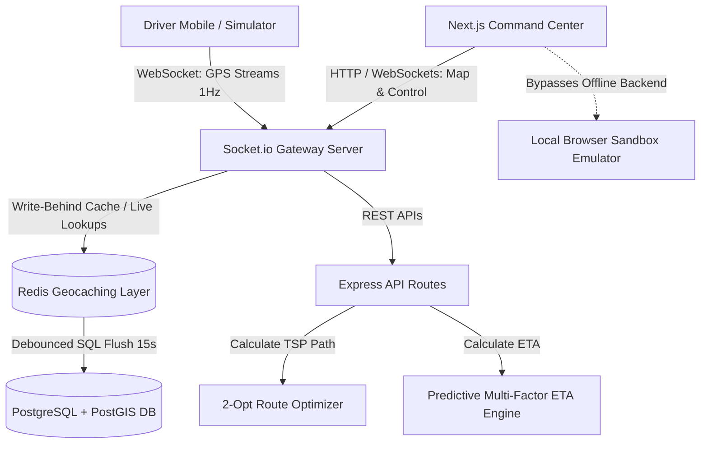

# 🛰️ LOGISTIQ COMMAND CENTER
> **High-Scale Real-Time Dispatch, Geo-caching & AI Routing Optimization Platform**

Logistiq is an enterprise-grade, high-throughput Logistics Management and Fleet Operations Command Center. The system simulates and manages high-frequency driver telemetrics ($1\text{ Hz}$ GPS updates), executes automated dispatch matching, solves multi-stop vehicle routes (2-Opt TSP/VRP), and visualizes live spatial demand forecasts.

---

## 🗺️ 1. SYSTEM DATA FLOW & ARCHITECTURE

The platform operates on a decoupled, real-time messaging architecture optimized for high-frequency location streaming and low-latency client visualization. 



### Architecture Resiliency Profiles:
1. **Live Production Engine:** Leverages the full TypeScript Express backend powered by WebSockets (`Socket.io`) to stream driver positions, order statuses, and route calculations in real time.
2. **Local Sandbox Mode:** If the backend server is offline or unreachable, the Next.js frontend gracefully degrades to run a client-side sandbox emulator. It runs simulated matching state machines, road paths, and driver positions directly in the browser using custom curve generators and intervals, keeping the dashboard interactive immediately out-of-the-box.

---

## 💎 KEY CAPABILITIES & SYSTEM ARCHITECTURES

### 1. High-Frequency GPS Ingress Pipeline
*   **Write-Behind Redis Cache:** Driver coordinates are ingested via Socket.io directly to an in-memory Redis cache (using GEOADD/GEORADIUS).
*   **Debounced Flush:** A background cron runner micro-batches location updates and flushes them to PostgreSQL/PostGIS every 15 seconds to prevent database write locks.
*   **Smooth Marker Interpolation:** Frontend canvas vehicles utilize a **Kalman Filter** and linear coordinate interpolation to glide smoothly along streets with zero GPS-drift noise.

### 2. The 2-Opt TSP Route Optimizer
*   **Local Search Heuristic:** Leverages a pure TypeScript Vehicle Routing Problem (VRP) solver.
*   **Crossing Avoidance:** Evaluates candidate edges and swaps coordinate paths (Nearest Neighbor + 2-Opt) to minimize travel durations.

### 3. Spatiotemporal Demand Forecasting
*   **Discrete H3 Hex Grid:** Simulates Uber H3 hexagonal layers to map order density weight forecasting.
*   **Live Hotspots:** Renders glowing color-coded hexagonal heatmaps to show active peak areas.

---

## 🛠️ TECH STACK

*   **Frontend:** Next.js 16 (App Router, Turbopack, TypeScript, Tailwind CSS, Leaflet Maps)
*   **Backend:** Node.js (Express, TypeScript, Socket.io)
*   **Primary DB Spec:** PostgreSQL + PostGIS (Spatial indexing)
*   **Cache Spec:** Redis (Geospatial indices)
*   **Workflows:** BullMQ + Redis task workers

---

## 📁 REPOSITORY STRUCTURE

```text
├── 📁 server/                       # Express Socket.io Server Engine
│   ├── tsconfig.json                # TypeScript configurations
│   ├── package.json                 # Backend dependencies
│   └── 📁 src/
│       ├── types.ts                 # Domain Type definitions
│       ├── optimizationEngine.ts    # 2-Opt TSP Route Solver, ETA Regressors
│       ├── dispatchEngine.ts        # Automated Driver Matcher State Machine
│       ├── simulator.ts             # Virtual GPS Telemetry Simulator
│       └── index.ts                 # Server Gateway Entry point
│
└── 📁 web/                          # Next.js App Router Client Dashboard
    ├── tsconfig.json                # Next.js TS configurations
    ├── package.json                 # Frontend dependencies
    └── 📁 src/
        ├── 📁 components/
        │   └── LiveMap.tsx          # Leaflet Dark-Themed Canvas Maps
        └── 📁 app/
            ├── globals.css          # Glassmorphic layout classes & glows
            ├── layout.tsx           # SEO Metadata Shell
            └── page.tsx             # Dispatch Dashboard Console
```

---

## 🚀 QUICK START GUIDE

### 1. Boot up the Socket & Express Server
```bash
cd server
npm install
npm run dev
```
Runs on: `http://localhost:3001` (WebSocket gateway: `ws://localhost:3001`)

### 2. Launch the Next.js Operations UI
```bash
cd web
npm install
npm run dev
```
Runs on: `http://localhost:3000`

---

## 🛡️ DUAL-STATE RESILIENCY (SANDBOX MODE)
If no active backend engine is running, the frontend dashboard gracefully degrades to **Local Sandbox Engine Mode**. The browser will dynamically generate simulated matching engines, route solvers, and GPS movements directly on the client, ensuring the platform is immediately interactive out-of-the-box!
