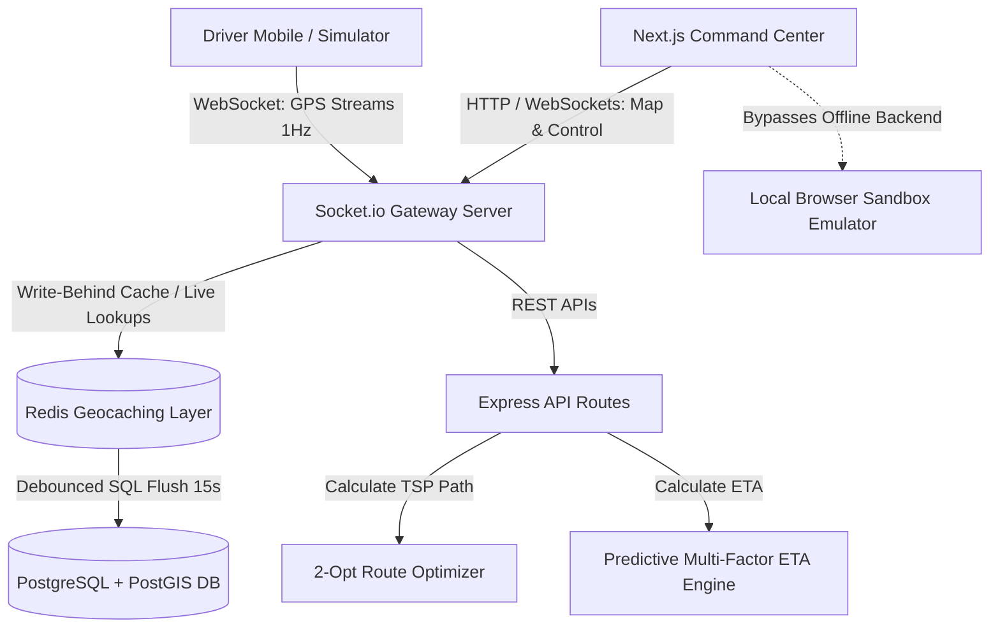

# 🛰️ LOGISTIQ COMMAND CENTER
> **High-Scale Real-Time Dispatch, Geo-caching & AI Routing Optimization Platform**

Logistiq is an enterprise-grade, high-throughput Logistics Management and Fleet Operations Command Center. The system simulates and manages high-frequency driver telemetrics ($1\text{ Hz}$ GPS updates), executes automated dispatch matching, solves multi-stop vehicle routes (2-Opt TSP/VRP), and visualizes live spatial demand forecasts.

---

## 🗺️ 1. SYSTEM DATA FLOW & ARCHITECTURE

The platform operates on a decoupled, real-time messaging architecture optimized for high-frequency location streaming and low-latency client visualization. 



### Architecture Resiliency Profiles:
1. **Live Production Engine:** Leverages the full TypeScript Express backend powered by WebSockets (`Socket.io`) to stream driver positions, order statuses, and route calculations in real time.
2. **Local Sandbox Mode:** If the backend server is offline or unreachable, the Next.js frontend gracefully degrades to run a client-side sandbox emulator. It runs simulated matching state machines, road paths, and driver positions directly in the browser using custom curve generators and intervals, keeping the dashboard interactive immediately out-of-the-box.

---

## 🧠 2. KEY CAPABILITIES & ALGORITHMIC GRIDS

### A. High-Frequency GPS Ingress & Client LERP Interpolation
*   **Write-Behind Redis Cache:** Driver coordinates are ingested via Socket.io directly to an in-memory Redis cache (using `GEOADD` and `GEORADIUS`). A background runner micro-batches location updates and flushes them to PostgreSQL/PostGIS in debounced intervals to prevent database locks.
*   **Smooth Coordinate LERP:** To prevent vehicle markers from jumping or lagging on the Leaflet map grid, coordinates are smoothed using linear interpolation (LERP) mapped to browser animation frames (`requestAnimationFrame`), enabling fluid vehicle glide along street nodes.

### B. Automated Nearest-Neighbor Dispatch Engine
*   **Geospatial Match Pipeline:** When an order transitions to `SEARCHING_DRIVER`, the system queries nearby available drivers, computes their score matrix, and targets the optimal match.
*   **State Machine Lifecycle:**
    $$\text{DRAFT} \longrightarrow \text{PLACED} \longrightarrow \text{SEARCHING\_DRIVER} \longrightarrow \text{ACCEPTED} \longrightarrow \text{ARRIVED\_AT\_PICKUP} \longrightarrow \text{PICKED\_UP} \longrightarrow \text{IN\_TRANSIT} \longrightarrow \text{DELIVERED}$$
*   **Proposal Timeout Retry:** If a proposed driver ignores or declines a match proposal within the 30-second response window, the engine flags the rejection and recalculates the match for the next best available candidate.

### C. 2-Opt TSP Routing Optimization Heuristic
To optimize multi-stop itineraries and eliminate crossing paths (reducing travel time and delivery mileage), the routing solver runs a local search heuristic:
1. **Nearest Neighbor Seed:** Forms a baseline path by appending the geographically closest next stop sequentially.
2. **2-Opt Swap Evaluation:** Loops through segments and evaluates whether reversing the intermediate nodes reduces the total Haversine path distance.
3. **Iterative Convergence:** Swaps edges until no further improvement is detected or the maximum iterations are reached.

$$\text{Evaluate Swap: } \Delta D = \left(\text{Dist}(A, C) + \text{Dist}(B, D)\right) - \left(\text{Dist}(A, B) + \text{Dist}(C, D)\right)$$

### D. Predictive Multi-Factor ETA Model
The system calculates a highly precise estimated time of arrival (ETA) rather than using simple static speeds:
*   **Circuity Factor:** Converts spherical geodesic (Haversine) distance into actual driving road distance using a routing multiplier coefficient ($1.28$).
*   **Weather Degradation Coefficients ($C_w$):** Penalizes average velocity (e.g., Rain = $18\%$ speed reduction, Fog = $30\%$, Storm = $50\%$).
*   **Temporal Congestion Multipliers ($C_t$):** Adjusts speeds dynamically during peak rush hours (8-10 AM, 5-8 PM = $38\%$ reduction), lunch traffic, and overnight clearance.
*   **Loading Overhead:** Appends a static $180\text{ seconds}$ warehouse staging buffer.

$$\text{ETA (seconds)} = \frac{\text{Geodesic Distance} \times 1.28}{\text{Base Speed (10m/s)} \times C_w \times C_t} + 180$$

### E. Spatiotemporal Demand Forecasting Grid
*   **H3 Honeycomb Hex Grid:** Operates a honeycomb layout simulating Uber’s spatial H3 grid indexes.
*   **Dynamic Volume Waves:** Runs high-speed spatial sine-wave cycles to simulate active order density shifts throughout the day, rendering live colored heatmaps to guide drivers towards future hotspots.

---

## 🛠️ TECH STACK

*   **Frontend:** Next.js 16 (App Router, Turbopack, TypeScript, Tailwind CSS, Leaflet Maps)
*   **Backend:** Node.js (Express, TypeScript, Socket.io)
*   **Primary DB Spec:** PostgreSQL + PostGIS (Spatial indexing)
*   **Cache Spec:** Redis (Geospatial indices)
*   **Workflows:** BullMQ + Redis task workers

---

## 📁 REPOSITORY STRUCTURE

```text
├── 📁 server/                       # Express Socket.io Server Engine
│   ├── tsconfig.json                # TypeScript configurations
│   ├── package.json                 # Backend dependencies
│   └── 📁 src/
│       ├── types.ts                 # Domain Type definitions
│       ├── optimizationEngine.ts    # 2-Opt TSP Route Solver, ETA Regressors
│       ├── dispatchEngine.ts        # Automated Driver Matcher State Machine
│       ├── simulator.ts             # Virtual GPS Telemetry Simulator
│       └── index.ts                 # Server Gateway Entry point
│
└── 📁 web/                          # Next.js App Router Client Dashboard
    ├── tsconfig.json                # Next.js TS configurations
    ├── package.json                 # Frontend dependencies
    └── 📁 src/
        ├── 📁 components/
        │   └── LiveMap.tsx          # Leaflet Dark-Themed Canvas Maps
        └── 📁 app/
            ├── globals.css          # Glassmorphic layout classes & glows
            ├── layout.tsx           # SEO Metadata Shell
            └── page.tsx             # Dispatch Dashboard Console
```

---

## 🚀 QUICK START GUIDE

### 1. Boot up the Socket & Express Server
```bash
cd server
npm install
npm run dev
```
Runs on: `http://localhost:3001` (WebSocket gateway: `ws://localhost:3001`)

### 2. Launch the Next.js Operations UI
```bash
cd web
npm install
npm run dev
```
Runs on: `http://localhost:3000`

---

## 🛡️ DUAL-STATE RESILIENCY (SANDBOX MODE)
If no active backend engine is running, the frontend dashboard gracefully degrades to **Local Sandbox Engine Mode**. The browser will dynamically generate simulated matching engines, route solvers, and GPS movements directly on the client, ensuring the platform is immediately interactive out-of-the-box!
